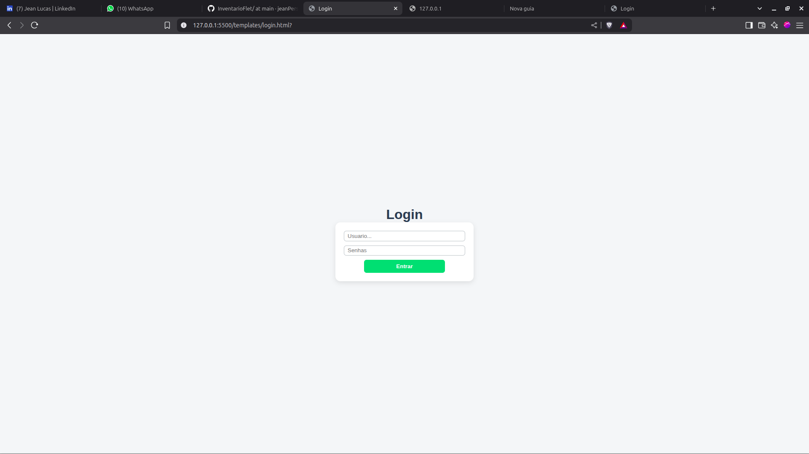
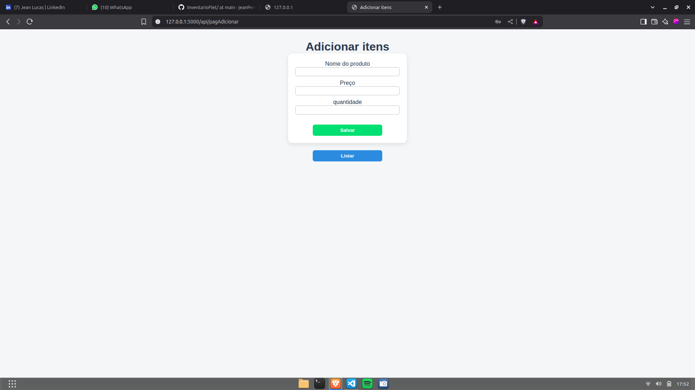
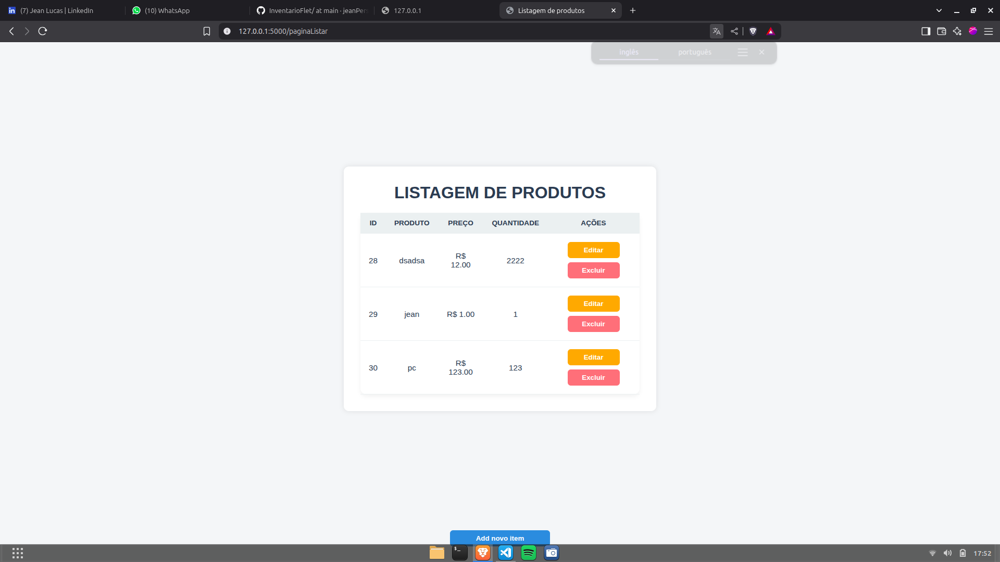

# 🧪 Projeto de inventario com Flask

Este é um projeto simples desenvolvido com o objetivo de **praticar os conceitos básicos do framework Flask**, utilizado para criar aplicações web com Python. Ele simula um pequeno sistema de login e gerenciamento de produtos.

---

## 🔧 Tecnologias utilizadas

- **Python 3**
- **Flask**
- **HTML5**
- **JavaScript (ES Modules)**
- **SQLite** (banco de dados local)
- **CSS básico (opcional)**

---

## 🎯 Objetivo

> O projeto foi criado com fins **educacionais** para praticar:

- Estrutura básica de uma aplicação Flask.
- Criação de rotas e APIs REST.
- Comunicação entre o frontend (JavaScript) e backend (Flask).
- Uso de banco de dados SQLite.
- Sistema de login simples.

---

## ⚙️ Funcionalidades

- **Tela de login**: autenticação de usuário com verificação no banco de dados.
- **Página de cadastro de produtos**: adicionar nome, preço e quantidade.
- **Listagem de produtos**: exibe os itens cadastrados.
- **Edição e exclusão** de produtos (via API).
- Uso de `fetch` no JavaScript para se comunicar com a API do Flask.

--

## 🖼️ Capturas de Tela

### 🔐 Tela de Login



### ➕ Página de Adição de Produtos



### 📋 Página de Listagem de Produtos



## ▶️ Como executar

1. **Clone o repositório** ou baixe os arquivos.
2. Certifique-se de ter o **Python 3** instalado.
3. Instale o Flask (caso ainda não tenha):
   ```bash
   pip install flask
   ```

python app.py

👤 Usuário padrão para teste
Usuário: admin

Senha: admin123
